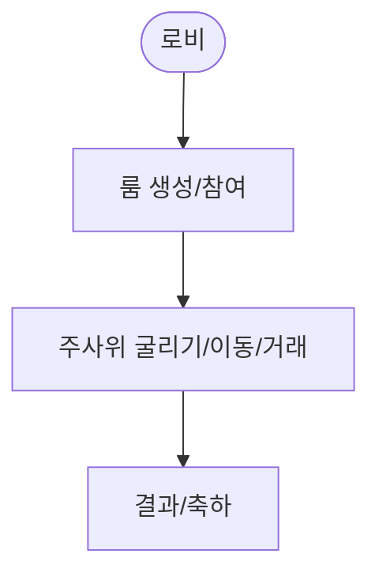

# 03 부루마블 보드게임 사양서 (초안)

## 1. 프로젝트 기본 정보

- 목적: 실시간 멀티플레이 보드게임 제공
- 사용자: 보드게임 팬/일반 사용자
- 기간: 2개월

## 2. 요구사항 정의

### 2.1 기능 요구사항

- 주사위/이동 애니메이션, 자산 구매/거래
- 실시간 매칭/채팅/알림

### 2.2 비기능 요구사항

- 지연/동기화 문제 대응, 서버 스케일링 고려

## 3. 기술 스택

- React + Socket.io, Node.js 또는 Python asyncio, MongoDB

## 사용자 흐름 (Mermaid)

